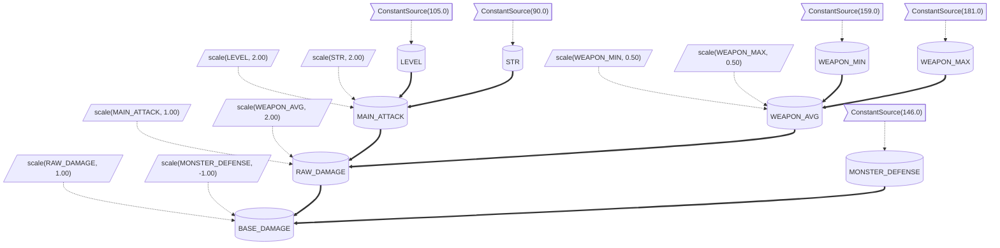

# zzstat - Hardcode-Free MMORPG Stat Engine

A highly optimized, completely data-driven, and deterministic stat calculation engine designed specifically for RPG and MMORPG servers. 

**zzstat** provides everything you need to build complex game mechanics without writing a single line of hardcoded game logic. With zero I/O, no async primitives, and an incredibly fast `O(1)` copy-on-write `fork()` architecture, you can evaluate thousands of combat formulas and buffs concurrently with maximum performance.

## 🚀 Features at a Glance

- **JSON Data-Driven:** Define your stat formulas, buffs, combat skills, and conditional abilities entirely in JSON. Let Game Designers balance the game without touching Rust code.
- **Dependency Graph Resolution:** Automatically resolves complex dependency chains (`ATK = STR * 2`, `DAMAGE = ATK - DEF`) with topological sorting and cycle detection.
- **Resource Pools & DoT/HoT:** Track stateful values like Current HP/MP, apply Damage over Time (Poison), and trigger custom Events (like `DEATH`).
- **Temporary Status Effects (Buffs & Debuffs):** A `StatusEffectManager` that seamlessly applies temporary buffs using `fork()`, ensuring the character's base stats are never mutated. Supports stacking behaviors (`Refresh`, `Accumulate`, `Independent`).
- **Combat Engine (AST):** A fully JSON-driven Combat Abstract Syntax Tree (AST). Calculate complex damages involving `Chance` nodes (Crit, Dodge, Block) deterministically.
- **AI-Ready Guidelines:** Includes `AI_PROMPT.md` out-of-the-box so you can instantly generate perfectly valid JSON files using AI assistants like ChatGPT, Claude, or Copilot.
- **Modular & High Performance:** Fully decoupled `StatRegistry` and `StatResolver` using `rustc_hash::FxHashMap` for blazingly fast `O(1)` operations.

---

## 🛠️ Core Modules

### 1. StatTemplate (Data-Driven Architecture)
Forget writing manual transforms in Rust. Load your entire class, monster, or item stat logic directly from a JSON string.

```json
{
  "name": "Knight Class",
  "transforms": [
    {
      "stat": "DEF",
      "phase": "additive",
      "rule": "additive",
      "type": "Conditional",
      "condition": { "operator": "Equals", "key": "STANCE", "value": "DEFENSIVE" },
      "transform": { "type": "Additive", "value": 50.0 }
    }
  ]
}
```

### 2. ResourcePool (State Management)
RPG games need to track current states. `ResourcePool` handles Current HP/MP, bounds it to a `StatResolver` stat (like `MAX_HP`), processes ticks for DoTs, and emits events when thresholds are hit.

```rust
// Poison DoT (-20 HP/tick for 3 ticks)
hp_pool.add_effect(TimeEffect {
    name: "Poison".to_string(),
    amount_per_tick: -20.0,
    ticks_remaining: 3,
});

// Emits "DEATH" event if HP falls to 0
hp_pool.add_trigger(ThresholdTrigger {
    condition: TriggerCondition::Empty,
    event_name: "DEATH".to_string(),
});
```

### 3. StatusEffectManager (Temporary Buffs/Debuffs)
Adding a temporary buff shouldn't permanently alter the base stats. `zzstat` uses an `O(1)` copy-on-write `fork()` method to overlay stats dynamically.

```rust
let buff = StatusEffect {
    id: "WARCRY".to_string(),
    name: "Warcry".to_string(),
    bonuses: vec![Bonus::add(atk_id)
        .flat(50.0)
        .in_phase(TransformPhase::Additive)],
    max_stacks: 1,
    stack_behavior: StackBehavior::Refresh,
};

// Add 50 ATK for 3 ticks
status_manager.add_status_effect(buff, Some(3), 1);

// Use the active resolver safely
let current_atk = status_manager
    .get_active_resolver(&base_resolver)
    .resolve(&atk_id, &ctx)
    .unwrap();
```

### 4. CombatEngine & Bytecode VM
Evaluate complex attack commands defined entirely in JSON. You can run formulas recursively on the AST, or compile them into a flat bytecode list (`Opcode`s) to run them inside a high-speed stack-based VM.

```rust
// Compile the formula into flat bytecode
let compiled = formula.compile();

// Evaluate bytecode in the VM (maximum performance)
let damage = CombatEngine::evaluate_compiled(
    &compiled,
    &mut attacker,
    &ctx,
    &mut defender,
    &ctx,
    &mut rng,
).unwrap();
```

### 5. Graph Visualization (Mermaid.js)
Export your entire stat dependency tree, including all active bonuses and active transforms, into a `graph TD` Mermaid string natively. Perfect for generating live documentation for your game's mechanics!

```rust
let mermaid_code = resolver.export_mermaid();
```

Generates output that renders directly in GitHub, Notion, and Mermaid Live Editor:

```

### 6. New in v0.5.0: Conditional Buffs, Triggers & Hierarchy
- **Conditional Status Effects:** Apply conditional requirements to item/buff modifiers using `.with_condition(condition)`.
- **Reactive Triggers:** Register `EffectTrigger`s that fire automatically when game events occur (e.g. applying a Shield status effect when `current_hp` drops below 30.0).
- **Hierarchical Environments:** Fork resolvers recursively (`Weather -> Zone -> Party -> Character`) and inherit all active modifiers. Any changes in parent layers (e.g. weather changes) propagate instantly.

---

## ⚡ Performance & Determinism
In MMORPG architecture, backend loops calculate stats for thousands of entities per second.
1. **Zero Allocations on Runtime Graph:** Calculations trace predefined paths using robust caching (`FxHashMap`).
2. **Copy-on-Write Forks:** Applying a buff creates an `Arc` overlay in nanoseconds.
3. **Fixed-Point Arithmetic (Optional):** Ensure cross-platform floating-point precision issues never desync your lockstep gameplay.

---

## 📚 Examples
Explore the `/examples` directory for comprehensive guides on how to use `zzstat`:
- `01_template_loader.rs`
- `02_resource_pool.rs`
- `03_status_effects.rs`
- `04_combat_engine.rs`
- `05_graph_export.rs`
- `metin2/` (Full MMORPG Damage Simulator)

Run them with:
```bash
cargo run --example 01_template_loader
cargo run --example metin2
```

## 🤝 Using AI to Create Content
You can use ChatGPT, Claude, or any LLM to generate perfectly formatted stat and combat JSONs for `zzstat`. Simply copy the contents of `AI_PROMPT.md` and give it to your AI assistant.

---

## 📖 API Documentation
For comprehensive API documentation including all structs, methods, and types, you can generate and open the Rustdoc HTML directly on your machine:
```bash
cargo doc --open
```
Additionally, check out the `docs/` folder in the repository for detailed guides and architectural walkthroughs in both English and Turkish.

---

## 🏗️ Reusable Multi-Language Architecture

zzstat is built as a reusable stat engine library rather than a Rust-only package. The core engine is written in Rust, and it exposes an FFI-compatible C ABI layer. Other languages consume it dynamically, avoiding the need to run a microservice or rewrite the calculation logic.

```
                zzstat-core
                    |
                  Rust
                    |
              C ABI / FFI Layer (zzstat-ffi)
                    |
        ----------------------------
        |             |            |
       Go          Python        C# (Unity)
```

### Usage Modes

1. **Native Rust library:** Directly add `zzstat` package to your Cargo.toml and use it inside your Rust application.
2. **Embedded application through bindings:** Compile the C ABI layer (`zzstat-ffi`) and load the shared library (`.so`, `.dylib`, `.dll`) dynamically in Go, Python, C#, or any other language supporting FFI/dynamic linking.
3. **Optional future gRPC service:** Build a lightweight gRPC server on top of the core engine if you require network-based microservices.

---

## 🛠️ Building Native Libraries

To compile the FFI library for dynamic loading:

```bash
# Build the dynamic library in release mode
cargo build --release -p zzstat-ffi
```

This will produce:
- Linux: `target/release/libzzstat_ffi.so`
- macOS: `target/release/libzzstat_ffi.dylib`
- Windows: `target/release/zzstat_ffi.dll`

---

## 🐹 Go Bindings (Purego)

The Go binding package is purego-compatible, meaning it requires **zero CGO dependencies** and loads the library dynamically at runtime.

### Installation & Setup

1. Copy or build `libzzstat_ffi.so` to your library path.
2. Import the Go package:

```go
import "github.com/singoesdeep/zzstat/bindings/go"
```

### Example Usage

```go
package main

import (
    "fmt"
    "github.com/singoesdeep/zzstat/bindings/go"
)

func main() {
    resolver := zzstat.NewResolver()
    defer resolver.Free()

    ctx := zzstat.NewContext()
    defer ctx.Free()

    // Register constant sources
    resolver.RegisterConstantSource("HP", 100.0)
    resolver.RegisterConstantSource("HP", 50.0)

    // Register a multiplier (+50%)
    resolver.RegisterMultiplicativeTransform("HP", zzstat.PhaseMultiplicative, zzstat.RuleMultiplicative, 1.5)

    // Resolve HP: (100 + 50) * 1.5 = 225.0
    val, _ := resolver.Resolve("HP", ctx)
    fmt.Printf("Resolved HP: %f\n", val)
}
```

---

## 🐍 Python Bindings (ctypes)

The Python bindings use `ctypes` (standard library, zero external dependencies) to dynamically load and call the FFI layer.

### Example Usage

```python
import zzstat

# Initialize resolver and context
resolver = zzstat.StatResolver()
ctx = zzstat.StatContext()

# Register sources
resolver.register_constant_source("HP", 100.0)
resolver.register_constant_source("HP", 50.0)

# Register multiplicative transform
resolver.register_multiplicative_transform(
    "HP",
    zzstat.StatResolver.PHASE_MULTIPLICATIVE,
    zzstat.StatResolver.RULE_MULTIPLICATIVE,
    1.5
)

# Resolve HP
hp = resolver.resolve("HP", ctx)
print(f"Resolved HP: {hp}")  # 225.0
```

---

## 🎮 C# & Unity Bindings

The C# wrapper uses standard P/Invoke signatures, allowing direct integration into Unity or .NET environments.

### Example Usage

```csharp
using Zzstat;

using (var resolver = new StatResolver())
using (var ctx = new StatContext())
{
    resolver.RegisterConstantSource("HP", 100.0);
    resolver.RegisterConstantSource("HP", 50.0);
    resolver.RegisterMultiplicativeTransform("HP", StatResolver.PHASE_MULTIPLICATIVE, StatResolver.RULE_MULTIPLICATIVE, 1.5);

    double hp = resolver.Resolve("HP", ctx);
    System.Console.WriteLine($"Resolved HP: {hp}"); // 225.0
}
```

---

## License
This project is licensed under the MIT License.
